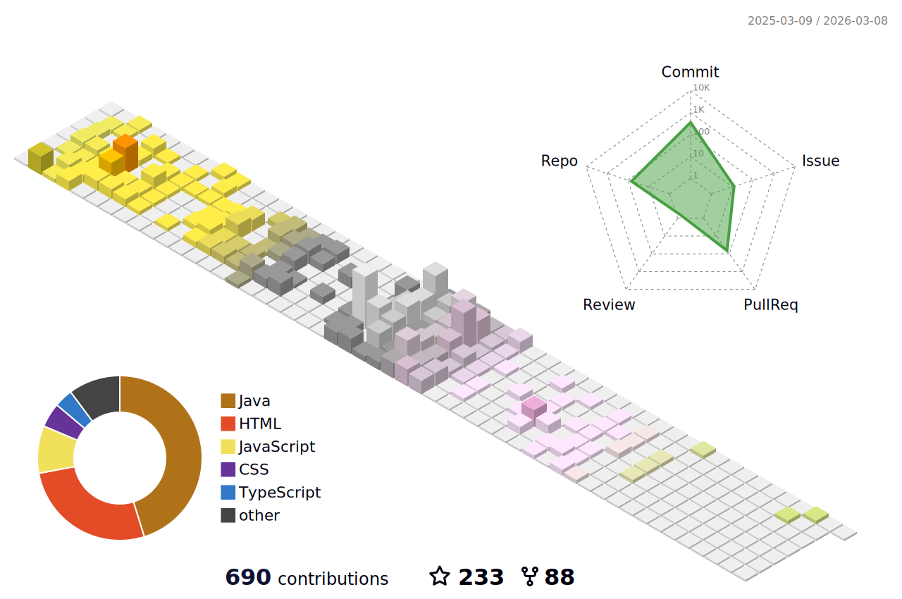

<!-- This Sanajit-Jana/sanajitjana's Repository is most important and valuable repository because its `README.md` (this file) appears as Github profile. -->

# Hi there, Myself <a href="https://sanajitjana.github.io" target="_blank">Sanajit Jana</a> 

## I'm a Web Developer, Designer and Life-Long Learner!

### Glad to see you 

 

I work as a Web Developer with UI/UX design skills (front-end design) based in Kolkata, WB-India.
Since 2017 I've been living and breathing web development and creating modern and user friendly interfaces. I've had the chance to immerse myself in many different works and projects, helping to make this world a little better through design & code. ✨😍

 

### What I'm focusing on 👨‍💻

- 🌱 Currently learning Java programming 😎
- 👯 I’m looking to collaborate with other developer
- 🥅 2022 Goals: Make Project and Contribute to Open Source
- ⚡ Fun fact: I love to make photos and videos
- 🔭 I just launched my portfolio: **[https://sanajitjana.github.io/](https://sanajitjana.github.io)**

   

### Familiar Languages:

 
 

### Used Tools:

 
 

<!-- ### My GitHub Stats: -->

  

  
    

