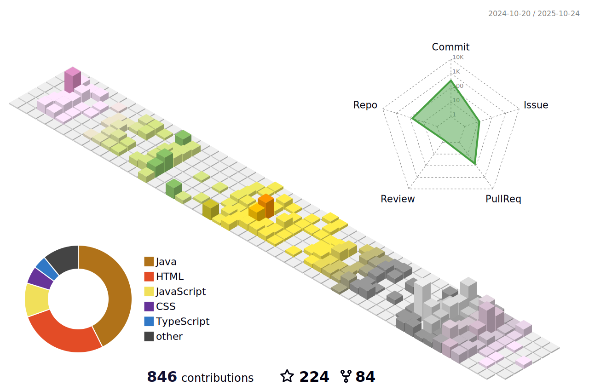

<!-- This Sanajit-Jana/sanajitjana's Repository is most important and valuable repository because its `README.md` (this file) appears as Github profile. -->

# Hi, Myself <a href="https://sanajitjana.github.io" target="_blank">Sanajit Jana</a> 

## I'm a Web Developer, Designer and Life-Long Learner!

 

 

### What I'm focusing on 👨‍💻

- 🌱 Currently learning Java programming 😎
- 👯 I’m looking to collaborate with other developer
- 🥅 2022 goals: Make project and contribute to Open Source
- ⚡ Fun fact: I love to make photos and videos
- 🔭 I just launched my portfolio: **[https://sanajitjana.github.io/](https://sanajitjana.github.io)**
- 💼 See my experience over the year: **[Resume](https://sanajitjana.github.io/packages/resume/Sanajit%20Jana_Resume.pdf)**

   

### Familiar Tech Stack:

<!-- coding boy -->

<!-- language -->

 

### Used Tools:

 

### Interests:

- Explore new Tech 💻
- Travel & Ride 🌎

<!-- ### My GitHub Stats: -->

  

    
  

